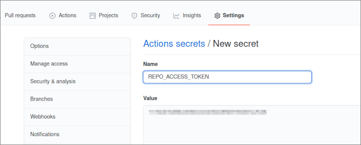

# reveal-yourself

Using Github Actions to automate cargo build for multiple binaries and create tags.

[1. About](#1-about)  
[2. Intallation](#2-installation)  
[3. What I Did](#3-what-i-did)  
&nbsp; &nbsp; [3-1. Dispatch Custom Event](#3-1-dispatch-custom-event)  
&nbsp; &nbsp; [3-2. Get Current Version](#3-2-get-current-version)  
&nbsp; &nbsp; [3-3. Get Commit Hash](#3-3-get-commit-hash)  
&nbsp; &nbsp; [3-4. Set Env Variables](#3-4-set-env-variables)  
&nbsp; &nbsp; [3-5. Build Multiple Binaries](#3-5-build-multipe-binaries)  
[4. Notes](#4-notes)  
&nbsp; &nbsp; [4-1. PAT Setup](#4-1-pat-setup)  
[5. LICENSE](#5-license)  


## 1. About

Using Github Actions to automate:

- Build for multiple platforms
- Generate a tag based on the package version (defined in `Cargo.toml`)
- Make the binaries available on the release page

You see most of the work in:

```
.github/workflows
 ├─ main.yml
 └─ release.yml
```

but detailed explanations are available in
*[3. What I Did](#3-what-i-did)* as well.


## 2. Installation

The intention is to demonstrate *Github Actions*,
and not actually the Rust program itself,
but you may install the program to check.
For this program simple read the current directory,
and reveal the files available under the directory.

I tested on Ubuntu only, and have not on MacOS.  
For Ubuntu:

```
# Download binary
$ wget https://github.com/minagawah/reveal-yourself/releases/download/v{VERSION}-{HASH}/reveal-yourself-linux-x86_64
$ chmod 775 reveal-yourself-linux-x86_64
$ ./reveal-yourself-linux-x86_64

# Or, download the sources, and compile
$ wget https://github.com/minagawah/reveal-yourself/archive/v{VERSION}-{HASH}.tar.gz
tar -xzvf v{VERSION}-{HASH}.tar.gz
cd v{VERSION}-{HASH}
cargo build --release
```

I will build for other platforms when I have time.  
[BurntSushi/ripgrep](https://github.com/BurntSushi/ripgrep/tree/31adff6f3c4bfefc9e77df40871f2989443e6827#installation)
may help me on this.


## 3. What I Did

As mentioned at the top, I wanted to automate some jobs I manually do.  
And, that are:

- Build for multiple platforms
- Generate a tag based on the package version (defined in `Cargo.toml`)
- Make the binaries available on the release page

however, there are some problems.

### 3-1. Dispatch Custom Event

The problem is that it currently does not allow me to run
different VM in a single job.
I found a solution in
[this great post](https://mateuscosta.me/rust-releases-with-github-actions)
which suggests to dispatch a custom event,
and prepare corresponding jobs triggered by the dispatched event.
So, I mainly followed what the post tells.

Here are the files for the jobs:

```
.github/workflows
 ├─ main.yml
 └─ release.yml
```

In `main.yml`, I am using
[peter-evans/repository-dispatch](https://github.com/peter-evans/repository-dispatch)
to dispatch a custom event, called `tag-created`.
To this event, I can attach any payloads,
and they will be shared  with jobs defined in `release.yml`.

**Note:**
It is probably worth mentioning that
I had a hard time figuring out how to setup PAT (Personal Access Token)
which is required when dispatching repository events,
and I have [a separate note to explain in detailed steps](#4-1-pat-setup).

So, I am dispatching a custom event with, for instance, the following payload:

```
Ex.
{ "new_version": "v1.1.11-abcd123" }
```

where `v1.1.11-abcd123` is an example,
and what I meant was: `v{CURRENT_VERSION}-{COMMIT_HASH}`

### 3-2. Get Current Version

First of all, I want `CURRENT_VERSION`.
I want to extract the current version defined in my `Cargo.toml`.  
For this,
[toml-cli](https://crates.io/crates/toml-cli)
gives me exactly what I want:

```
$ toml get Cargo.toml package.version | tr -d \"
0.1.3
```

### 3-3. Get Commit Hash

Another thing is `COMMIT_HASH`,
which is very easily done:

```
git rev-parse --short HEAD
```

### 3-4. Set Env Variables

So, I have `CURRENT_VERSION` and `COMMIT_HASH`,
and I am setting them to `$GITHUB_ENV`
so that I can use them later.
Using
[peter-evans/repository-dispatch](https://github.com/peter-evans/repository-dispatch),
I am packing these two environmental variables into its payload:

```yaml
      # Set the current version to `env.CURRENT_VERSION`
      - name: Get current version
        run: |
          CURRENT_VERSION="$(toml get Cargo.toml package.version | tr -d \")"
          echo "CURRENT_VERSION=$CURRENT_VERSION" >> $GITHUB_ENV

      # Set the commit hash to `env.COMMIT_HASH`
      - name: Get commit hash
        run: |
          COMMIT_HASH="$(git rev-parse --short HEAD)"
          echo "COMMIT_HASH=$COMMIT_HASH" >> $GITHUB_ENV

      # Dispatching a repository event `tag-created`
      # with its payload `new_version` being:
      # `v{CURRENT_VERSION}-{COMMIT_HASH}
      - name: Dispatch event
        uses: peter-evans/repository-dispatch@v1
        with:
          token: ${{ secrets.REPO_ACCESS_TOKEN }}
          event-type: tag-created
          client-payload: '{"new_version": "v${{ env.CURRENT_VERSION }}-${{ env.COMMIT_HASH }}"}'
```

### 3-5. Build Multiple Binaries

As `tag-created` event is dispatched, the jobs in `release.yml` run in parallel manner.
As you can see, when specifying `use-cross: true` to
[actions-rs/cargo](https://github.com/actions-rs/cargo),
it `cross` instead of `cargo`. When we actually build,
it is easy as we just specify the target defined in `matrix`:

```yaml
    strategy:
      matrix:
        include:
          - os: ubuntu-latest
            artifact_name: reveal-yourself
            asset_name: reveal-yourself-linux-x86_64
            target: x86_64-unknown-linux-musl
          - os: macos-latest
            artifact_name: reveal-yourself
            asset_name: reveal-yourself-macos-x86_64
            target: x86_64-apple-darwin

    steps:
      - name: Checkout
        uses: actions/checkout@v2
      - name: Setup Toolchain
        uses: actions-rs/toolchain@v1
        with:
          toolchain: stable
          target: ${{ matrix.target }}
          override: true
      - name: Build
        uses: actions-rs/cargo@v1
        with:
          use-cross: true
          command: build
          args: --release --target ${{ matrix.target }}
```

FYI, here is
[a list of available targets](https://doc.rust-lang.org/beta/rustc/platform-support.html).


## 4. Notes

### 4-1. PAT Setup

When using
[peter-evans/repository-dispatch](https://github.com/peter-evans/repository-dispatch),
as it is mentioned in its description,
even if you already have your GITHUB_TOKEN generated,
it does not allow the event dispatcher to access your repo,
and you must create a new token (e.g. `REPO_ACCESS_TOKEN`).

Without setting PAT, Github Actions throws the following error (when dispatching event):
```
Error: Parameter token or opts.auth is required
```


Here are the steps for setting up your PAT:

#### (Step 1) Create a new PAT (Personal Access Tokens)

1. Click your Github profile icon, and you see `Settings`
2. `Settings > Developer Settings > Personal access tokens`
3. Generate a new token with arbitrary chosen name (e.g. `REPO_ACCESS_TOKEN`), and grant `repo` scope.
4. Copy the `secret`


#### (Step 2) Go to your repo's settings

Now, go to your project repository, and go to `Settings > Secrets`.  
Click `New repository secret`.


#### (Step 3) Set the `secret`

For `secret` you just copied, register to your repo:




## 5. License

Dual-licensed under either of the followings.  
Choose at your option.

- The UNLICENSE ([LICENSE.UNLICENSE](LICENSE.UNLICENSE))
- MIT license ([LICENSE.MIT](LICENSE.MIT))

